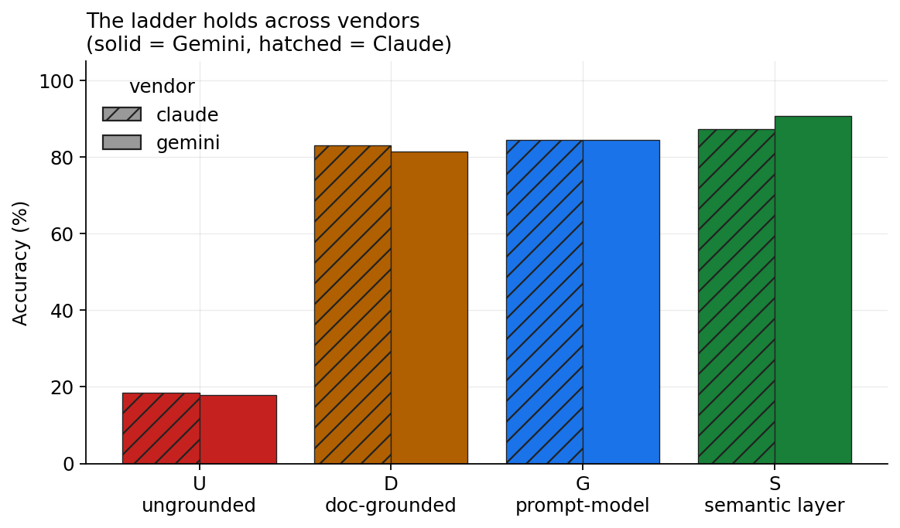

# Introduction

The dominant narrative around large language models (LLMs) and data is that natural-language-to-SQL
closes the "last mile" between a business user and their warehouse: ask a question in English, get a
query, get an answer. The narrative is half right. Modern models are genuinely good at *syntax* —
they emit well-formed SQL in the correct dialect with high reliability. But a well-formed query is
not a correct answer. The difficulty in enterprise analytics has never been syntax. It is
**semantics**: knowing that "revenue" means shipped-or-delivered orders net of discounts and not the
convenient pre-computed `line_total` column; that a shipping fee recorded at *order* grain must not
be summed across the *line* rows it fans out over; that forty different customers named "John Smith"
are forty identities, not one; that two source systems which share no key can only be joined through
a bridge after their email addresses are normalized. None of this is in the physical schema. It
lives in the heads of analysts, in wiki pages, in tribal memory — and, increasingly, in a **semantic
layer**.

**The missing step in ELT.** For a decade the canonical data pipeline has been *Extract, Load,
Transform* — ETL, and latterly ELT once cheap warehouse compute let teams transform after loading.
Transform's job is to produce clean, correct *tables*: typed, deduplicated, conformed. But a clean
table is not a *meaning*. "Which of these columns is revenue, net of what, at which grain, excluding
which statuses, joined to customers by which key" is not a property of the table — it is a separate
artifact that sits above it, and today it has no agreed place in the pipeline. We propose one. We name
the step that produces and governs that artifact **Model** — **M** — and the extended pipeline
**ELTM** (*Extract → Load → Transform → Model*): the future of ELT. To be clear about provenance, ELTM
is not an existing industry term; we are coining it here, and we define it precisely so it can be
argued with and measured.

We also name the M's output, and the distinction is the crux. We borrow the medallion vocabulary of
bronze/silver/gold deliberately, and it is worth being precise about where we keep it and where we
break from it: the raw (bronze) and refined (silver) layers carry over essentially unchanged — the
divergence is entirely at **gold**.^[This architectural reframing — bronze → a lossless landing zone,
silver → a refined zone held at the lowest grain, and the replacement of a *physical* gold layer with
a *virtual, semantic* one — is developed at length in C. van Heerden, "Beyond the Medallion:
Architecting the Post-Dashboard Data Era for AI," Google Cloud Community (2026),
<https://medium.com/google-cloud/beyond-the-medallion-architecting-the-post-dashboard-data-era-for-ai-0253c483512e>.
The mapping is therefore *not* one-to-one with traditional ETL: bronze and silver map cleanly, but the
Semantic Gold Layer supersedes the physical gold layer rather than renaming it.] Where "gold" denotes
the curated, business-ready top, the conventional gold layer is a set of curated *tables*. A single wide, denormalized gold table is genuinely flexible
*within its grain*: revenue by region, by category, by month are all one table and a `GROUP BY`, no new
pipeline. The trap is at the **boundaries** it cannot cross. A table is aggregated to one grain, so you
cannot drill *below* it (a daily-revenue-by-region rollup cannot answer a per-order question — the
detail is gone). And it spans one fact at one grain, so it cannot, by itself, put order-grain shipping
next to line-grain revenue, join sales to a separate returns event, or reach across the CRM/HR/LMS
divide. Each of those is a new build: a ticket, days of latency, and a fresh chance to define revenue
inconsistently. This is the *Golden Layer Trap* — flexible until you hit a grain, fact, or domain
boundary, then stuck.

The M's artifact is different in kind. We call it the **Semantic Gold Layer**: not another tier of
tables but a *governed layer of meaning* over them — an enforced semantic model of measures at their
true grains, identities, and joins that **compiles any question on demand**, including the ones that
cross those boundaries, and refuses what it cannot answer. You do not pre-build the slice; you model
each *measure once at its real grain* and then drill down to detail, combine measures across grains,
join across facts and source systems, and follow up freely — every combination generated correctly at
query time. Transform gives you gold *tables*; the M gives you the *Semantic Gold Layer*, and the
difference between them is the difference between a fixed answer and an answerable model. The thesis of this paper — and of the book it
accompanies, *The Semantic Gold Layer* — is that in the LLM era the M is no longer optional polish but
the load-bearing step: it is what stands between a fluent model and a wrong number. Everything that
follows is an attempt to *measure* that claim rather than assert it.

Concretely, the mapping to the medallion architecture is layer-by-layer, and it is only at the top that
we depart:

| Medallion layer | What it holds (traditional BI) | ELTM stage | What changes for the AI era |
|---|---|---|---|
| **Bronze** | Raw data landed from sources, append-only | **Landing Zone** | Unchanged — lossless, replayable capture |
| **Silver** | Cleaned, typed, deduplicated, conformed | **Refined Zone** | Unchanged in spirit, with one rule made explicit: kept at the *lowest grain*, never pre-aggregated |
| **Gold** | Curated *physical* marts, pre-aggregated for dashboards | **Semantic Gold Layer** (the **M**) | Replaced *in kind*: physical tables become a *virtual, governed* model of measures, grains, and joins — compiled on demand, and able to refuse |

: Bronze and Silver carry over almost unchanged; the divergence — physical gold tables giving way to a virtual, enforced semantic layer — is entirely at gold. {#tbl-medallion}

This paper isolates one causal question and answers it under controlled conditions:

> **Does the *form* in which business semantics are supplied to an LLM change the correctness of the
> analytics it produces — and if so, how much of the effect is the *content* of the semantics versus
> the deterministic *enforcement* of them?**

To answer it we hold everything else fixed — the same business-language questions, the same data, the
same ground truth — and vary only the grounding along a four-rung ladder (§[-@sec-ladder]). We build
two synthetic-but-realistic warehouses (§[-@sec-data]) whose correct answers are known *by
construction*, seeded with the specific traps that separate syntax from meaning. We evaluate
**9 models across two vendors** (Gemini and Claude), score **4485** trials
(§[-@sec-method]), and report where each rung of grounding helps, where it does not, and — crucially
— *what kind* of failure each rung leaves behind (§[-@sec-results]).

Our findings are threefold. First, grounding helps enormously and monotonically: accuracy rises from
**17.9%** ungrounded to **90.2%** under the semantic layer, with the identical
ordering U < D ≲ G < S for **both** vendors. Second, the climb *decomposes*: certified **content**
(U→G) buys most of the gain and is deliverable in a prompt, while deterministic **enforcement** (G→S)
buys a further, statistically significant increment concentrated in the highest-stakes failure modes
— silent fan-out, confident answers to unanswerable questions, and definition drift across a
conversation. Third, and most importantly, enforcement is a **trade**, not a free lunch: because the
layer can only answer what is modeled, it is near-perfect on governed questions and *refuses* the
rest, underperforming the free-form conditions on ad-hoc metrics it was never given. For any setting
where a wrong number is worse than no number — most of enterprise finance and operations — that trade
is the one you want.

# Background and related work

**Text-to-SQL.** A long line of work — from WikiSQL and Spider [@yu2018spider] to execution-accuracy
benchmarks like BIRD [@li2023bird] — measures whether a model translates a natural-language question
into an executable, correct query against a *given, well-specified* schema. These benchmarks
deliberately provide clean schemas and unambiguous questions; they measure translation skill. Our
question is orthogonal and complementary: we hold translation skill constant (the same models) and
vary the *semantic grounding*, using business-language questions whose correct interpretation is
*not* recoverable from the physical schema alone.

**Retrieval-augmented generation and grounding.** RAG [@lewis2020rag] supplies a model with
retrieved documents at inference time. In analytics this manifests as "context files" — markdown
descriptions of tables and metrics pasted into the prompt. Our conditions **D** and **G** are two
representations of exactly this idea (documents vs. a structured model), and let us measure whether
*representation* matters when *content* is held identical.

**Semantic layers.** The semantic layer externalizes business definitions into a governed, versioned
artifact that compiles to SQL. Its promise is *consistency*: one definition of revenue, enforced
everywhere. The idea has several concrete instantiations that differ mainly in how the model is
authored and where it is enforced: **LookML** (Looker), which expresses measures, dimensions, joins,
and grain as declarative code that Looker compiles to dialect-specific SQL at query time; **dbt's
Semantic Layer / MetricFlow**, which defines metrics alongside transformation models; and headless
layers such as **Cube** and **AtScale**. LookML is notable for handling grain and fan-out safety
(symmetric aggregates) and access control as first-class, enforced properties rather than conventions;
we treat it as one realization of the pattern, not as the object of study. Deliberately, then, our
condition **S** is *vendor-neutral*: a generic deterministic compiler over a validated query plan, so
the result is a property of enforcement itself rather than of any product. The question S isolates is
what that enforcement adds *beyond* putting the same definitions in the prompt.

**This work** contributes: (i) a four-rung grounding ladder that cleanly separates content from
enforcement; (ii) two open, seeded benchmark datasets with *ground truth by construction* and planted
semantic traps; (iii) a reproducible harness and deterministic scorer; and (iv) an empirical,
two-vendor decomposition of where — and why — each rung of grounding changes the answer.

# The grounding ladder {#sec-ladder}

We define four conditions. Every condition receives the identical business-language question and
queries the identical warehouse; they differ *only* in how business semantics are supplied and
whether they are enforced.

- **U — Ungrounded.** Only the physical schema (DDL); the model writes one SQL query. The "point the
  model at the database" baseline.
- **D — Document-grounded.** The DDL plus a bundle of grounded **documents** — an
  Open-Knowledge-Format-style markdown corpus (frontmatter, prose definitions, per-metric and
  per-table pages describing meaning, grain, joins, vocabulary). The "context files / RAG" condition.
  It still writes raw SQL.
- **G — Prompt-grounded model.** The DDL plus the *same facts* as **D**, serialized as a compact
  **structured semantic model** (measures with base grains and aggregation SQL; dimensions with
  identity/label annotations; a join graph; vocabulary maps). It still writes raw SQL. Because **D**
  and **G** are emitted from a single source of truth, any D-vs-G difference is *representation*, not
  content.
- **S — Semantic-layer-mediated.** The model may **not** write SQL. It selects fields and returns a
  **query plan**; a deterministic compiler validates the plan against the model and generates
  fan-out-safe SQL, or returns a **structured refusal** when the question cannot be answered from the
  modeled fields. Enforcement lives in the compiler, not the model.

The ladder is designed so that **D→G** isolates *representation* (documents vs. structured model,
content held equal) and **G→S** isolates *enforcement* (same content, but deterministically compiled
and refusable rather than free-form). @fig-decomp makes this decomposition explicit.

The compiler underpinning **S** provides three guarantees *by construction*, independent of the
model: (1) each measure is aggregated at its declared base grain and measures at different grains are
combined via a full outer join on shared dimensions, so an order-grain measure can never fan out over
line rows; (2) a measure requested with a dimension finer than its grain is **refused**, not silently
inflated; (3) unknown fields are refused, and business vocabulary (and calendar values such as a bare
year) are resolved to stored representations. These are exactly the failure modes that separate a
well-formed query from a correct answer.

# Benchmark design {#sec-data}

## Ground truth by construction

Every dataset is generated by a seeded program, so the correct answer to every question is known
*analytically* — not adjudicated by a human or an LLM judge. Ground truth is computed through the same
certified compiler that condition **S** uses, over the seeded data. This is the methodological
keystone: it removes grader subjectivity and makes the pipeline reproducible with `make reproduce`.

## D1 — NorthStar Commerce (retail)

A line-item retail warehouse (customers, products, orders, order-items, marketing, returns) seeded
with the canonical semantic traps: **grain / fan-out** (`shipping_fee` at *order* grain, discounts at
*line* grain; a deliberately wrong pre-discount `line_total` column); **identity vs. label** (forty
distinct `customer_id`s share the name "John Smith"); **compound keys** (a `returns` table keyed by
`(order_id, line_number)` with an *undeclared* FK — joining on `order_id` alone inflates refunds by
**3.65×**); **messy vocabulary** ("paid search" stored as `paid_search`,
`Paid-Search`, `PPC`); **time intelligence** (a February-start fiscal calendar); and **ambiguity /
refusal** (questions with no answer in the schema, and genuinely ambiguous ones that should trigger
clarification).

## D2 — Cross-Domain Enterprise (Learning × Sales × HR)

Three source systems that *look* unrelated. Sales opportunities are keyed by `employee_id`; a
learning-management system is keyed by a **messy email**; an HR bridge is the *only* path between them,
and only after the email is normalized (lowercased, legacy `.contractor` alias stripped). D2 plants a
**causal effect by construction**: completing an "Advanced Negotiation" course raises quota attainment
by a true **+0.129** (tenure-adjusted), while course completion is
itself correlated with tenure, so the *naïve* gap is a larger **+0.1722**; a
placebo course has a null effect (**-0.002**). A certified rollup resolves the
identity join once inside the layer; conditions U/D/G must reconstruct it from raw tables (the bridge
rollup is deliberately absent from the physical DDL they see).

## Test suites

Eight suites: (1) certified metrics, (2) grain & fan-out, (3) compound keys, (4) cross-domain
correlation & join, (5) multi-query synthesis, (6) multi-turn conversations, (7) ambiguity, vocabulary
& refusal, and (8) time intelligence. All questions are phrased in business language; no schema column
names leak into the prompt.

# Methodology {#sec-method}

**Models and vendors.** We evaluate two vendors. From **Google Gemini** (called via the Generative
Language API): `gemini-2.5-flash-lite`, `gemini-2.5-flash`, `gemini-2.5-pro`, `gemini-3.5-flash`,
`gemini-3.7-flash` (the current-generation flash tier), and `gemini-3.1-pro-preview` (the
current-generation Pro tier). From **Anthropic Claude**: `claude-haiku`,
`claude-sonnet`, and `claude-opus`. The tiers span a wide capability range within each vendor, testing
whether raw capability substitutes for grounding. Note that condition **S** never asks a model to
author SQL — its correctness is a property of the compiler, largely invariant to model choice.

*A note on version pinning, for transparency.* The identifiers above are the exact model strings we
called, and we report them precisely because the effect we measure could otherwise be confused with a
model-selection artifact. Two honest caveats follow from this. First, the Gemini strings without a
date suffix are **rolling aliases**, not immutable snapshots — the provider may update the weights they
point to over time — so an exact re-run reproduces our *harness and data* deterministically but not
necessarily the provider's model of a given day; `gemini-3.1-pro-preview` is additionally a preview
build. Second, the Claude tiers name the vendor's Haiku/Sonnet/Opus classes as served during the run;
combined with the batched subagent protocol for that arm (below), the Claude results are best read as
*corroborating* the ladder rather than as a snapshot-pinned replication. The load-bearing result —
condition **S** — is the most robust to all of this, since S's correctness comes from the compiler, not
the model.

**Protocol.** For U/D/G we build the condition's prompt, extract the SQL, execute it on DuckDB, and
compare to ground truth; for S we compile the returned plan and execute, or record its refusal. A
refusal to an *answerable* question scores wrong; a refusal to an *unanswerable* one scores correct.
The output-token budget is 2048 for all tiers except the reasoning-tier `gemini-3.1-pro-preview`,
which uses 8192: at 2048 that model spends the budget on hidden "thinking" tokens and truncates the
visible SQL mid-statement (a harness limitation that produces a spurious parse error, not a genuine
model failure), so we give it headroom to emit a complete query.
The two smaller Gemini tiers are run five times per cell and the others one to three times; we report
95% cluster-bootstrap confidence intervals that resample **questions** (the unit of generalization),
so the intervals reflect question-to-question variation, not just run noise. The Claude arm is
administered through a batched protocol (grounding shown once per condition, every question answered
independently, one run) — a documented variant of the Gemini per-call protocol (§[-@sec-threats]).

**Coverage.** We report the number of runs per (model × condition) and flag every tier as complete or
partial; the 7 complete tiers reached ~all questions and anchor all pooled numbers,
while two partial single-run tiers (which ended after the first suites) are reported separately and
never averaged into a headline. Perfect-looking scores from a tier that never reached the hard suites
are thus impossible to mistake for the real thing.

**Scoring.** Numeric answers use a 1% relative tolerance; set/top-N answers use order-insensitive
matching. A distinct outcome class, `declined_unmodeled`, separates condition S’s *legible declines* of
un-modeled ad-hoc metrics (it returns modeled components or refuses) from genuinely wrong answers, so
the two are never conflated in any table. Beyond correctness we compute (i) **error magnitude** — the
relative error when a numeric answer is wrong; (ii) heuristic **SQL audits** flagging fan-out, partial-key joins, missing certified
filters, use of the known-bad `line_total`, un-normalized identity joins, and grouping a label instead
of an identity (these target model-written SQL and are not applied to the compiler-generated SQL of
condition S); and (iii) **consistency** across paraphrases. Statistics: McNemar exact paired tests
between adjacent rungs, pairing on (question, model, run).

# Results {#sec-results}

## The ladder

Pooled across the 7 complete-coverage models and both datasets, accuracy rises
monotonically along the grounding ladder (@fig-ladder): **U 17.9%** (95% CI [7.7,
28.9]) → **D 81.7%** ([75.4, 88]) → **G 84.5%** ([77.9,
90.5]) → **S 90.2%** ([83.9, 95.6]). Every adjacent step is significant by
McNemar’s exact test (U→D *p*≈1e-191; D→G *p*≈9e-5; G→S *p*≈1e-5).
The ungrounded baseline is not merely worse — it is close to unusable on business-language questions,
because the physical schema does not encode what the questions mean. (Two partial single-run tiers,
`gemini-2.5-pro` and `gemini-3.5-flash`, reached only the first one-to-two suites before their run
ended; their high scores reflect easy questions only and are excluded from every pooled number —
their partial coverage is disclosed with per-cell counts, not silently averaged in.)

A note on what S’s sub-100 means before the iteration of §[-@sec-promotion]. Decomposing condition S’s
outcomes among the 7 complete-coverage models (n=1017 S runs), only
**1.1%** of its answers are *genuinely wrong* — a confidently returned incorrect number.
A further **7%** are **legible declines**: questions asking for an
ad-hoc metric not yet in the model, where S returns the modeled components or refuses rather than
inventing a value. We score these as a distinct `declined_unmodeled` class, never as `correct` but
also never conflated with hallucination — because the two failure modes could not be more different for
a user who must trust the number. S essentially does not hand back a wrong number; it hands back a
smaller, honest one, or nothing.

{#fig-ladder width=80%}

## Representation versus enforcement

@fig-decomp decomposes the climb. Moving from an ungrounded prompt to the certified structured model
(U→G) adds **+66.6** points — the value of *content*, deliverable in-prompt. Moving from that
same content in the prompt to deterministic enforcement (G→S) adds a further **+5.7**
points. In paired terms, S *corrects* 116 cases that G got wrong while *regressing*
on 58 (McNemar *p*≈1e-5); the regressions are almost entirely ad-hoc
metrics the layer was never given (§[-@sec-tradeoff]), while the corrections are silent, high-stakes
errors — fan-out, un-refused impossibilities, drift.

{#fig-decomp width=80%}

Comparing the two *representations* of identical content, document-grounding (D) and structured-model
grounding (G) reach **81.7%** and **84.5%** (D→G *p*≈9e-5) — structure
helps modestly beyond prose, and both vastly outperform no grounding.

## The ladder holds across vendors

The effect is not a quirk of one model family. The same ladder appears across both vendors and across
model generations — from the 2.5-era Gemini tiers through the current-generation `gemini-3.7-flash`
and `gemini-3.1-pro-preview`, and across the Claude Haiku/Sonnet/Opus tiers (@fig-vendor): Gemini
U 17.8% → S 90.6%, Claude U 18.4% → S
87.2%. Across the 7 complete-coverage models, the ordering
**U < D ≤ G < S** holds for every model, and condition **S** is strikingly *consistent* — each lands
between 84.4% and 100% under the layer — whereas U/D/G swing widely with capability (see
§[-@sec-capability]). (The two partial tiers show D/G *inversions* on their easy-suite-only coverage —
`gemini-2.5-pro` scores D above G, `claude-opus` ties them — which is a coverage artifact, not a
counterexample; we use ≤ rather than < between D and G for exactly this reason.)

This vendor split is a **robustness check that the ladder replicates, not a vendor benchmark**, and
should not be read as a ranking. The two vendors' pooled sets are not matched capability-for-capability
— the Gemini pool deliberately includes a weak floor tier (`gemini-2.5-flash-lite`) with no equivalent
in the Claude pool, which if anything drags the Gemini average down — so the takeaway is that *both
vendors climb the same rungs in the same order*, at every tier we tested.

{#fig-vendor width=85%}

## Drill-down without getting stuck: gold tables vs. the Semantic Gold Layer {#sec-composability}

The benchmark is, incidentally, a direct test of the gold-table-vs-Semantic-Gold-Layer distinction
drawn in the introduction — and we are careful not to overstate it. A single wide gold table handles
same-grain group-bys perfectly well; `net_revenue` alone is queried 9
different ways (total, by region, by category, by month, by fiscal year, by channel, by customer
identity, filtered to paid search), and we do **not** claim those need a table each — a denormalized
line table serves all eight with a `GROUP BY`. The airtight claim is narrower and stronger. Of the
**30 distinct question-shapes** the suites exercise (from
21 certified measures), **10 cross a grain, fact,
or domain boundary that no single pre-aggregated table can span**: 3
combine measures at different base grains (order-grain shipping beside line-grain revenue; sales beside
the separate returns event; a cross-grain ratio), and 7 reach across
the CRM / HR / LMS source-system divide via the identity bridge. (Several additional questions scored
against hand-written SQL — shipping-as-%-of-revenue, net-of-refunds, the tenure-confounded lift — are
also cross-boundary, so 10 is a conservative floor.) Condition S compiles
every one of these on demand from the fixed measure set; a pre-aggregated gold layer needs a new build
for each, because the boundary is exactly what one table cannot cross. The full classification, with
the reason per shape, is reproduced by `score/composability.py`.

The multi-turn case study (@fig-drift) shows the same property *dynamically*: a user drills from total
net revenue, to net revenue by region, to shipping by region (an order-grain measure now beside a
line-grain one — a grain boundary), to shipping as a percentage of revenue, and back — and the layer
follows the drill-down turn by turn, recompiling each at the right grain rather than getting stuck on a
fixed rollup. This is what "keep context and drill down" means operationally: not a wider
pre-computation, but a model that answers the *next* question, and the one after that, without anyone
rebuilding a table. Where a governed answer does not yet exist (the un-modeled ratio at turn 4) the
layer declines legibly rather than returning a stale or wrong number — and, per §[-@sec-promotion],
that gap is closed once by promoting a measure, never again.

## The drill-down trap: what happens when there is nowhere to drill {#sec-drilldown}

Composability shows the semantic layer can drill anywhere; a natural follow-up asks what a model does
when it *cannot* — when it is handed a conventional pre-aggregated gold layer whose detail below its
grain has been summed away. We built a small controlled test: two pre-aggregated gold tables
(revenue by region×month, sales by category) and six questions — four that need sub-grain detail the
aggregates discarded (a specific customer, the paid-search channel, distinct-customer counts, a
region×category cross) and two controls the aggregates *can* answer. Three conditions, four Gemini
tiers, three runs: **P0** (gold tables only, a naive "answer this" prompt), **P** (the same gold
tables, but the prompt also offers `REFUSE` as an option), and **S** (the semantic layer, which can
drill to base grain).

The result is stark, and it isolates *where* the danger actually lives (@fig-drilldown). On the
un-answerable drill-downs, condition **P0 never once declined**: across 48 runs it
refused 0 times and instead returned a confident, wrong number
**33** times (erroring on the rest). Give the *same boxed model* an explicit
way out — condition **P** — and it refuses **45** of 48 and
hallucinates **0**. Condition **S** simply drills to the base grain and is
correct **48/48**. All three handle the controls (P0, P, and S each
correct on 24/24), confirming the failure is
specific to drilling *below* the pre-aggregated grain, not the tables being unusable. As a reference
point, condition **U** — which *has* the base tables but is run with the same naive, no-refuse prompt —
also fabricated (43 of 48): confident fabrication is driven by
the "must answer" framing, and only *removed* by either an escape hatch (P) or reachable detail (S).

Two lessons follow. First, the practitioner's instinct is right but the mechanism is precise: a model
boxed into an aggregate does not know it is stuck — *given no way to say so, it fabricates every time.*
Second, the mitigations are of different kinds. Offering a refuse affordance is a cheap and effective
patch (it converts fabrication into abstention), but it only ever yields "I can't answer that." The
semantic layer removes the trap outright, because the detail is still reachable: it answers. Pre-
aggregation is not a performance optimization with a documentation footnote; it is a decision to make
a class of questions unanswerable, and an ungoverned model will paper over that decision with
confident fiction.

{#fig-drilldown width=85%}

## Model-orchestrated joins vs. the pre-joined layer {#sec-agentic}

The cross-domain result (§[-@sec-tradeoff] below and the D2 suite) already shows that a model writing a
single cross-source `JOIN` in SQL underperforms the pre-joined layer. But the pattern most often
proposed today is more ambitious: point an agent at *two* sources — two connections, two "explores" —
and let it issue separate queries and *stitch the results itself*. We tested that mode directly. In
condition **MQ** the model may run only single-table queries (no joins), one at a time, in an agentic
loop, seeing each result and carrying keys and values between steps to combine the sources by hand;
we compare it to **S**, one deterministic pre-joined query. On the five D2 cross-domain questions
(@fig-agentic):

- **Accuracy: MQ 7% vs. S 80%.** Stitching by hand is where it slips —
  ferrying hundreds of join keys through a capped result set, aggregating before rather than after the
  join, and reconstructing the email-normalization bridge each time. A representative failing run issues
  five queries — resolve the course id, list its 318 completers, fetch their emails, normalize those to
  employee ids, average attainment — but the row cap truncates the 318-key handoff, so the final average
  runs over a subset and lands near the truth by luck rather than by construction.
- **Capability does not fix orchestration.** Per tier the accuracy is flash 20%,
  flash-lite 0%, and the flagship pro 0% — the strongest
  model scored *zero* at self-joining two sources. Orchestration skill is not a capability the ladder
  climbs; it is work the layer should do once.
- **Efficiency: 4.3 queries per question vs. 1**, about **29× the
  tokens** (13255 vs. 460) and **~27× the latency**
  (26.5s vs. 1s).

For a like-with-like comparison the S arm is restricted to the same Gemini tiers MQ ran on; S is
89% on the Gemini subset, 80% on the Claude subset, and
88% pooled — identical, so the restriction does not affect the result. (The pro
MQ arm is partial — 11 of 15 runs completed before the ~26.5s orchestration
loop timed out on one question; its completed runs scored 0%, in line with the others.)

We are careful about the determinism claim: at temperature 0 the self-join was not *flaky* — it was
*consistently* wrong. The layer's advantage is therefore not "less random" but *correct by
construction*: one compiled query returns the right answer every time at a small fraction of the cost.
(The single-query interface caps returned rows, as a real tool would; without the cap the self-join
would trade its accuracy failure for an even larger token bill, passing hundreds of literals between
steps.) The lesson for the agentic era is concrete: if two sources will be asked about together,
*pre-join them once in the model* — the explore is the join, done deterministically — rather than
asking the agent to rediscover and recompute it, expensively and unreliably, on every question.

{#fig-agentic width=90%}

## Where enforcement wins, and where it trades {#sec-tradeoff}

@fig-suite breaks accuracy down by suite, and this is where the honest, nuanced picture emerges.
Condition **S** is at or near the top exactly where governance decides the answer:

- **Certified metrics** (suite 1): S 99.6% — the certified definition of revenue, applied
  identically every time.
- **Cross-domain join** (suite 4): S 97% — the identity bridge and email normalization
  are modeled once; U/D/G must reconstruct them and often cannot.
- **Time intelligence** (suite 8): S 100% — the fiscal calendar and calendar-year filters
  compile correctly by construction.
- **Ambiguity & refusal** (suite 7): S 90.5% versus D 49.2% and G
  49.7%. This is the signature result: asked questions with *no answer in the data* (revenue
  by customer age, top supplier), the free-form conditions fabricate a query against an unrelated column
  and return a confident number; **S refuses**. That is the difference between fail-loud and fail-silent,
  and it is an architectural property, not something a bigger model fixes.

The layer’s cost is flexibility. Because S can only answer what is modeled, it *underperforms* the
free-form conditions on ad-hoc synthesis it was never given: multi-query ratios and differences
(suite 5; suite 2) such as "shipping as a percentage of revenue" or "net revenue after refunds," which
are not certified measures. There, S returns the modeled components rather than an un-modeled derived
metric — wrong for the question, but *legibly* so (the `declined_unmodeled` class). It is worth being
precise about what drags S’s suite averages down here, because it is *not* fan-out or compound-key
failure — S’s guarantees hold: on the actual grain/fan-out questions (shipping by region, revenue and
shipping side-by-side, line counts) and the actual compound-key questions (refunds by category, joined
on the full key) S is correct. The only sub-100 cells are the handful of ad-hoc derived metrics
mis-bucketed into those suites, every one of which is a legible decline, not a wrong number.

We report this not as an embarrassment but as the mechanism itself. An un-modeled metric is not a dead
end; it is a **signal**. In the free-form regimes, "shipping as a percentage of revenue" is answered by
a model guessing at a formula every single time it is asked — sometimes right, sometimes silently wrong,
never accountable, and never the same twice. In the governed regime it is a request that surfaces to a
**human-in-the-loop semantic architect**: define the ratio once, *test it against known ground truth,
verify it, and promote it*. After promotion the metric is deterministically correct for that query and
every future query that touches it — and no one ever has to re-adjudicate it. The claim of this paper is
emphatically **not** that a semantic layer (or a grounded model) is always right. It is that correctness
becomes *testable, repeatable, and promotable*: a one-time engineering decision that compounds, rather
than a per-query gamble that must be re-won on every ask. What looks like S’s missing 34 points on the
ad-hoc suites is really the backlog of the architect’s job — and, unlike the free-form conditions’
errors, that backlog is visible, finite, and, once cleared, permanent.

{#fig-suite width=95%}

### The promotion experiment: the trade-off is the workflow {#sec-promotion}

The previous section’s "limitation" is testable as a *mechanism*. We ran a second, pre-registered
experiment: acting as the human-in-the-loop semantic architect, we took three of the ad-hoc metrics S
could not answer — "average shipping fee per order," "shipping as a percentage of revenue," and "net
revenue after refunds" — **defined each once** as a certified measure (two of them as derived measures
combining existing certified measures at different grains), **verified each against ground truth**
(all three match to within floating-point error), and **promoted** them into the single semantic
model. Because the model is one source of truth, the new definitions flow to conditions D, G, and S
alike. We then re-ran the affected questions.

The result is the compounding-governance claim in miniature (measured on the four models complete in
both runs — Gemini flash-lite and the three Claude tiers, to isolate the promotion from re-run noise):

- **Condition S rose from 84.9% to 92.6%** overall
  (**+7.7** points), and on the three affected suites the gains are large and
  mechanical: grain/fan-out **+43.8**, compound keys
  **+20**, multi-query synthesis **+50** points.
  Every model improved (Claude tiers +8.5 to
  +10.6; Gemini flash-lite +7).
  S now routes each promoted question to its certified measure and returns the exact value.
- The **control held**: condition **U**, whose prompt never changed, was flat
  (16.9% → 16.3%).
- Tellingly, merely lengthening the free-form prompt with the new definitions did **not** reliably help
  the document/prompt conditions — on the weakest model the extra context was as likely to distract as
  to help. Promotion improves the *enforced* layer deterministically; it does not reliably transfer to a
  model left to write its own SQL.

This is the point, not a caveat. In the free-form regimes, "shipping as a percentage of revenue" is
re-derived by a model guessing a formula on every ask — sometimes right, sometimes silently wrong,
never the same twice. In the governed regime it is a one-time engineering act: define, test, verify,
promote — after which it is deterministically correct for that query and every future query that touches
it, and no one re-adjudicates it. What looked like S’s missing points on the ad-hoc suites was simply
the architect’s backlog: visible, finite, and, once cleared, permanent. Correctness stops being a
per-query gamble and becomes a compounding asset.

### Reaching 100%: the cost per layer {#sec-reaching100}

If the backlog is finite, can it be cleared? We ran the iteration to its conclusion: continue playing
the architect until each condition is as accurate as it can be made, and **count the edits each layer
needs**. The asymmetry is the result (clean subset — Gemini flash-lite plus the three Claude tiers):

- **Condition S reached 100%** — every question, every run, for every one of the
  **4 models with complete coverage in both the baseline and iterated
  runs** (Gemini flash-lite and the three Claude tiers; the partial tiers also hit 100% on the subset
  they covered) — with **8 durable edits** (84.9% →
  100%). Five were certified-measure promotions or a truth correction;
  three were one-time compiler-robustness fixes (expression-measures; tolerating the key/operator/date
  spellings models use). Critically, **five of the eight required no model re-run at all** — the
  already-logged query plans simply recompiled correctly — and the three that did needed only that the
  *definition* be right; once it was, every model selected it. Correctness here is a property of the
  compiler, so a fix lands for every model at once and stays landed.
- **Conditions G and D hit a wall well below 100%.** We gave them the single highest-leverage edit a
  free-form condition can take — an explicit instruction to refuse the unanswerable, clarify the
  ambiguous, rank by identity, and respect grain. On the refusal/ambiguity questions it moved them
  sharply yet nowhere near certainty: G from 0% to
  **50%**, D to **42.9%** — versus S’s
  **100%** on the same questions. Even *told explicitly to refuse*, the
  free-form models fabricated SQL against an unrelated column or answered an ambiguous question anyway a
  large fraction of the time. A prompt can *ask* for refusal; it cannot *enforce* it. Pushing further
  would mean writing an exact SQL specification into prose for every remaining question — rebuilding the
  semantic layer in text, minus the enforcement, and still without a guarantee that a given model on a
  given run complies. There is no finite, durable edit set that pins D or G at 100%.
- **Condition U cannot be edited at all** without ceasing to be ungrounded; it stays at
  ~16.3%. The meaning the questions need is not in the schema. That is the ladder’s
  premise.

The lesson is not that the semantic layer is smarter. It is that correctness is *cheap and permanent*
to reach through enforcement — a handful of verified edits that hold across every model — and
*expensive, fragile, and ultimately unreachable* through prompting alone. "Get there faster" is not a
slogan; it is the difference between eight edits that converge and an infinite regress that does not.

## Enforcement compresses the capability gap {#sec-capability}

Across model tiers, the *ordering* of conditions is stable and, more strikingly, **S compresses the
spread between models**. The weakest model we tested, `gemini-2.5-flash-lite`, scores
69.6% at G but **84.8%** at S — the layer
lifts it by roughly the margin that separates it from a flagship model. Meanwhile every model, flagship
included, remains poor when ungrounded (15.7%–21.3% at U).
Capability improves fluent translation from good grounding; it does not, by itself, supply meaning, and
it does not confer the refusal and grain guarantees that S obtains by construction.

## When an answer is wrong, how wrong is it?

Accuracy understates the risk. On *wrong* numeric answers, the ungrounded condition’s median relative
error is **45.1%** (@fig-error-mag): errors are not
near-misses but large, confident, well-formed mistakes — the characteristic and dangerous failure of
ungrounded analytics, because a 45%-wrong number returned with valid SQL looks exactly like a right
one. The SQL audits localize the cause: ungrounded queries use the known-bad `line_total` column
**452** times and omit the certified status filter
**272** times across the run set; on D2 they join identities without
normalizing the email **69** times.

![Relative error on *wrong* numeric answers, by condition, over the 7
complete-coverage models (n per box annotated; 488 wrong-with-error
across conditions — a full-CSV recount including the two partial tiers gives 338 for U, same story).
The ungrounded condition is wrong far more often and its
errors cluster in the **20–60% "plausible on a dashboard" zone** — off enough to mislead, close enough
to escape notice. The grounded conditions are wrong rarely, but when they are it is on the hardest
synthesis questions, where the few errors are large. Being wrong *less often* and being wrong *by a
plausible-looking margin* are different risks; ungrounded analytics carries
both.](../paper_assets/figures/fig_error_mag.png){#fig-error-mag width=82%}

## Multi-turn drift

@fig-drift tracks accuracy across the turns of a conversation. For the free-form conditions, a certified
definition established at turn 1 can silently mutate by turn 5 as context accumulates — definition
**drift**. Because condition **S** compiles each turn independently from the governed model, drift is
structurally impossible.

![Multi-turn drift — a **case study** (one scenario, two models, three runs; n=6 per point, not a
headline result). D and G silently degrade at turns 3–4 as context accumulates. Condition S is correct
on every governed turn and, at turn 4 — the shipping-as-%-of-revenue ratio not in the model — *legibly
declines* rather than guessing; its dashed "never-wrong" line stays at 100%. The enforced layer does
not return a wrong number across the conversation. A single scenario cannot support a general drift
claim; we report it as an illustrative case and leave a multi-scenario drift suite to future
work.](../paper_assets/figures/fig_drift.png){#fig-drift width=82%}

## Cost

Grounding is not free in tokens, but the premium is modest and front-loaded into the prompt
(@fig-cost). Condition **S** is in fact the *cheapest* grounded layer to run and the fastest: it sends
a compact field catalog and emits a compact plan (mean 39 output tokens vs
87 for D) rather than a full SQL statement, where D and G resend the entire
knowledge base on every call. Per query this is roughly **4× cheaper than D and 2.5× cheaper than G**,
and across the whole benchmark D and G together consumed about **6.6× the tokens** S did.

The cost asymmetry is starkest in the *reaching-100* experiment (§[-@sec-reaching100]): driving S to
100% took ~110K tokens of re-runs — and five of its eight edits cost **zero** inference, recompiling
already-logged plans — whereas the D/G guardrail attempt spent ~4× as many tokens and still did not
converge. Enforcement is cheaper to run *and* cheaper to make correct.

{#fig-cost width=98%}

# Threats to validity {#sec-threats}

We summarize; the full treatment is in `LIMITATIONS.md`. **Vendor coverage:** we test two vendors
(Gemini, Claude) and 9 models, and the ladder replicates across both; we do not claim coverage of
all model families. **Claude-arm protocol:** the Claude arm is administered in a batched form (grounding
once per condition, questions answered independently, single run) rather than the Gemini per-call form;
the within-Claude ladder is therefore internally valid, and the cross-vendor agreement is corroborating
rather than perfectly matched. **Synthetic data:** synthesis is what makes ground truth exact and the
traps known; absolute accuracies would fall on messier production data, so we rest the claim on the
*ordering* U < D ≲ G < S and the decomposition, not the absolute numbers. **D/G token parity:** the two
representations share content by construction but not length (D ≈ 1.9× longer); we report tokens
alongside accuracy. **S is only as good as its model:** a miscertified measure would be confidently wrong
in S too — we measure fidelity of enforcement given a correct model, and reward "refuse when out of
scope," not omniscience; S’s trade-away of un-modeled ad-hoc metrics (§[-@sec-tradeoff]) is reported, not
hidden. **Public corpora (TPC-DS, Spider/BIRD) and BigQuery execution** are scoped out of this release;
the harness is dataset- and engine-agnostic, so they are straightforward extensions we do not claim here.

# Discussion

The result has a clean interpretation for practice. Put an LLM in front of a warehouse with nothing but
the physical schema and you get fluent SQL and unreliable answers, and the errors are large and silent.
Supply certified semantics — in whatever serialization — and you recover most of the correctness, in the
prompt. But the last, most dangerous residual — silent fan-out, confident answers to unanswerable
questions, definitions that drift over a conversation — is removed not by *describing* the semantics to
the model but by *enforcing* them in a deterministic compiler that can also refuse. Enforcement is a
trade: it constrains you to governed metrics and, in exchange, makes correctness a property of the system
rather than a hope about the model — and it does so most for the weakest models, compressing the
capability gap. The constraint is also the workflow: a question the layer cannot answer is a work item
for the semantic architect — define, test against ground truth, verify, promote — after which it is
correct in perpetuity. Correctness stops being re-litigated on every query and becomes a compounding
asset. This is what a free-form model cannot offer: not higher peak accuracy, but *durable, testable,
promotable* accuracy.

This is an argument for treating the semantic model as a first-class, enforced engineering artifact
rather than a description pasted into a context window — and it is the empirical core of the **ELTM**
proposal. The pipeline that has long been *Extract, Load, Transform* needs an explicit fourth step,
**Model**: *Extract → Load → Transform → **Model***, our proposed future of ELT. Transform hands you
correct tables; the M turns those tables into a governed *Semantic Gold Layer* — meaning over the data
that compiles a business question to correct SQL and refuses what it cannot answer. Two properties make the M a distinct step and not a sub-task of
Transform. First, it operates on a different object: Transform produces rows, the M produces
definitions, grains, identities, joins, and refusal boundaries. Second, its correctness *compounds* —
a verified measure is correct for every future query that touches it, across every model, which is
exactly what our reaching-100 iteration demonstrated and what no amount of Transform can supply. The
benchmark measures what that fourth step is worth:
on these datasets, across two vendors, it is the difference between an analytics assistant that is
confidently wrong most of the time when ungrounded and one that is correct or honestly silent.

**The cost of authoring the M.** The obvious objection is that a semantic model is expensive to build
and maintain. Our artifacts suggest the economics run the other way, because authoring cost and
coverage scale differently. The governed layer for the retail warehouse is a **136-line**
file — 14 measures and 10 dimensions — and its
cost grows *linearly*: the fifteenth measure costs about what the fourteenth did. What it *buys* grows
combinatorially: those 14×10 =
140 measure-by-dimension slices, before filters, grains, and
multi-measure combinations, are all answerable at query time from that one file, and each measure added
multiplies the space rather than adding to it. The enforcement machinery is a constant: the compiler is
**256 lines and dataset-agnostic**, and does not grow with the model at
all. The alternatives scale the wrong way — a pre-aggregated gold layer needs roughly a table per
grain×slice (combinatorial *build* sprawl), and in-context grounding resends an ever-larger prompt on
*every query forever* (we watched the weakest model degrade as that context grew). Real enterprise
models are of course far larger than ours — thousands of lines, hundreds of measures — and carry
genuine governance cost as they grow: conformed grains, join-path disambiguation, scoping what is
exposed. But that cost is centralized, linear-ish, and — critically — *testable and promote-once*
(§[-@sec-promotion]), where the sprawl and the prompt-bloat it replaces are neither.

# Conclusion

Holding questions, data, and ground truth fixed, the representation and enforcement of business semantics
supplied to an LLM change the correctness of its analytics from **17.9%** to **90.2%**
(pooled over the 7 complete-coverage models), with the same U < D ≤ G < S ordering in
both vendors. The gain decomposes into *content* (**+66.6**
points, recoverable in-prompt) and *enforcement* (**+5.7** points, recoverable only by
compiling and refusing).

The decisive property is not S’s peak accuracy but its *trajectory*. When we iterated to close the
remaining gap, condition **S reached 100%** with **8 durable, verifiable edits**
that held across every fully-covered model at once — most costing no inference, because a fix to a
deterministic compiler lands everywhere and stays landed. The free-form conditions, given the same
class of edit, **could not be driven to 100%** at any finite, durable cost: instructed explicitly to
refuse or to apply a certified formula, the models complied only part of the time, and closing the rest
would mean re-specifying every query in prose — rebuilding the layer without its one advantage,
enforcement. And S did this while being the **cheapest layer to operate**. Enforcement is not
universally the highest-scoring rung in every cell; it is the only rung whose correctness is
*testable, promotable, and compounding*. For any setting where a wrong number is worse than no number,
that is the rung that matters — and it is an architectural choice, not a prompting trick.

That rung has a name and a place in the pipeline. It is the **M** we propose adding to ELT — the
**Model** step, giving **ELTM** — and its output is the **Semantic Gold Layer**. Extract gets the data;
Load lands it; Transform cleans it into gold *tables*; but only **Model** turns those tables into a
governed layer of *meaning* that makes them *answerable* — correctly, cheaply, and durably — by a large
language model. Neither ELTM nor the Semantic Gold Layer is an established term; we coin both here and,
we hope, have measured them into something worth adopting. The empirical claim is simply that the M is
now load-bearing, and that its value is large, measurable, and compounding. Teams that ship an LLM onto
their warehouse without it are not one prompt away from correctness; they are missing a step.

## Reproducibility {.appendix}

All code, seeded data generators, semantic models, questions, ground truth, scorer, and statistics are
released. The pipeline reproduces with one command:

```
make reproduce      # data → run models → score → stats → plots
```

Repository layout: `datagen/` (seeded generators), `semantic_models/` (the single source of truth),
`emit/` (D and G emitters from that source), `compiler/` (condition S), `harness/` (runner, multi-turn,
and the Claude-arm batch/ingest utilities), `questions/` and `truth/` (business questions and
by-construction ground truth), `score/` (scorer, statistics, plots, number extraction), and `results/`
(all logged runs and derived tables). Gemini calls require a `GEMINI_API_KEY`; the Claude arm is
administered via subagents; every non-model step is deterministic.
